# OHS Shield Tracker — MVP 1 Architecture

> **Prompt 1 deliverable.** Source of truth: `MVP1_1.md` (Master Prompt). This document defines architecture only — no application code. Locked domain values (colours, typography, risk bands, status flows, RBAC matrix, incident severity) are owned by the Master Prompt and referenced, not redefined.
>
> **Status:** Draft for human approval. Decisions marked 🔖 feed the Decisions Ledger on approval.

---

## 0. Architectural Principles

| # | Principle | Consequence |
|---|---|---|
| P1 | **Clean Architecture, offline-first** | Domain never depends on Flutter/Supabase/Drift. Every write goes to the local store first, then syncs. |
| P2 | **Database is the security perimeter** | RBAC + multi-tenant isolation enforced by PostgreSQL RLS, never only in the UI. The client is untrusted. |
| P3 | **CRUD via PostgREST, logic via Edge Functions** | No hand-rolled REST layer. Edge Functions only where CRUD+RLS is insufficient (workflow guards, fan-out, aggregation). |
| P4 | **Every business action is auditable and immutable** | State transitions emit `audit_logs` rows with before/after; `audit_logs` has no UPDATE/DELETE path. |
| P5 | **Assets are fixed binaries** | The supplied icon is referenced by path (`assets/branding/app_icon.svg`), never redrawn (Master Prompt Item 1a). |
| P6 | **POPIA data minimisation** | Personal data (witnesses, injured parties) is minimal and visibility-restricted by RLS. |

---

## 1. Domain Model

### 1.1 Core entities and lifecycles

| Entity | Purpose | Status flow (locked — Master Prompt) |
|---|---|---|
| **Hazard** | An identified unsafe condition | Draft → Submitted → Assessment → Investigation → CAPA → Verification → Closed |
| **Risk Assessment** | Likelihood × Severity scoring of a hazard | (no workflow; owned by a hazard) — Score = L×S, band per locked risk bands |
| **Incident** | A first-class event that occurred | Reported → Investigated → CAPA → Verified → Closed |
| **Investigation** | Root-cause analysis of a hazard or incident | Open → In Progress → Pending Review → Completed |
| **Corrective Action (CAPA)** | A tracked remediation task | Created → Assigned → In Progress → Verification → Closed |
| **Inspection** | A checklist-based site check | Draft → In Progress → Submitted → Closed |
| **Inspection Item** | One checklist line; a fail auto-creates a Hazard + CAPA | pass / fail / n-a |

### 1.2 Supporting / cross-cutting entities

`companies` 🔖(proposed addition) · `sites` · `departments` · `users` · `roles` · `user_roles` · `user_profiles` · `notifications` · `device_tokens` · `attachments` · `attachment_versions` · `audit_logs` · `sync_queue`.

> **🔖 Decision D1 — add a `companies` table.** The Master Prompt's table list omits `companies`, yet Multi-Site Architecture mandates `company_id` on every tenant-scoped table with FK-backed isolation. A referenced FK needs a referenced table. **Recommendation:** add `companies` as the tenant root (`Company → Site → Department → User`). Logged in Open Questions for Prompt 2A confirmation.

### 1.3 Locked enumerations (referenced, not redefined)

- **Roles:** Employee · Supervisor · Safety Officer · Manager · Administrator
- **Risk bands:** 1–5 Low · 6–12 Medium · 13–17 High · 18–25 Critical
- **Incident severity:** Minor (Green) · Moderate (Amber) · Serious (Red) · Critical (Red, full intensity)
- **Hazard categories:** Physical · Chemical · Biological · Ergonomic · Psychosocial · Noise · Radiation · Environmental
- **Incident types:** Near Miss · First Aid · Medical Treatment · Lost Time Injury · Property Damage · Environmental Incident
- **CAPA priority:** Critical · High · Medium · Low
- **Inspection types:** Housekeeping · Fire Safety · PPE · Vehicle · Equipment

---

## 2. Core Business Processes

The platform's spine is one macro-process with satellite processes hanging off it.

**Primary lifecycle:** `Hazard Reported → Risk Assessment → Investigation → Corrective Action → Verification → Closure`

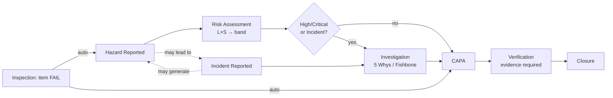

**Satellite processes**

1. **Incident capture** — first-class; may originate from a hazard and may spawn investigations, CAPAs, or follow-up hazards (bidirectional linkage).
2. **Inspection execution** — a failed checklist item auto-creates a Hazard **and** a CAPA (Edge Function, §8).
3. **Verification gate** — Incident/Hazard cannot reach *Closed* unless verification evidence exists **and** all linked CAPAs are Closed (enforced in Edge Function + guarded transition, §8/§10).
4. **Escalation** — overdue CAPAs / due investigations / due inspections raise notifications and priority (§11).

---

## 3. Bounded Contexts

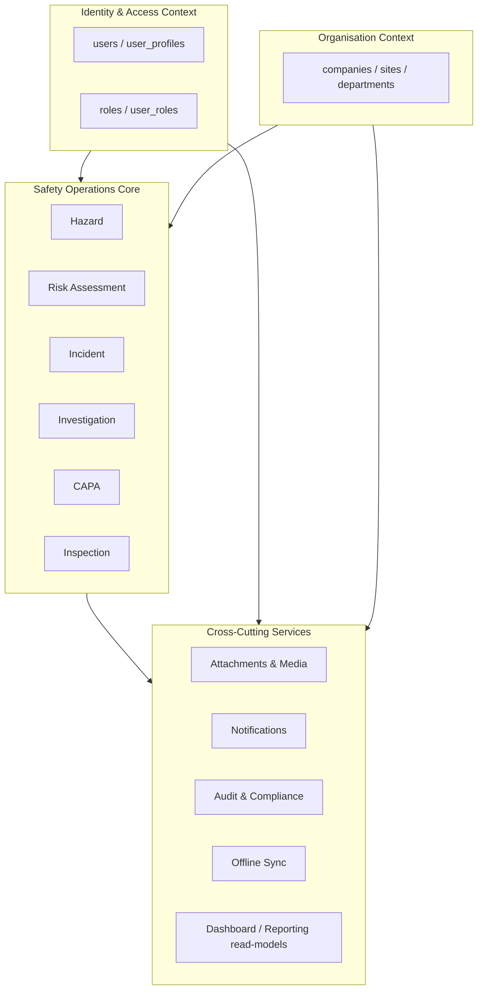

| Context | Owns | Consumes |
|---|---|---|
| **Identity & Access** | users, roles, user_roles, user_profiles, session, RBAC evaluation | — |
| **Organisation (Multi-Site)** | companies, sites, departments, tenant hierarchy | IAM |
| **Safety Operations Core** | hazards, risk_assessments, incidents, investigations, corrective_actions, inspections, inspection_items | IAM, ORG, all XC |
| **Attachments & Media** | attachments, attachment_versions, Storage objects | IAM, ORG |
| **Notifications** | notifications, device_tokens, escalation | Safety Core, IAM |
| **Audit & Compliance** | audit_logs (immutable), Audit Log Viewer | all contexts |
| **Offline Sync** | sync_queue (local + server), Drift mirror | Safety Core |
| **Dashboard / Reporting** | read-only aggregates, KPIs, exports | Safety Core (read) |

Contexts communicate **only** through repository interfaces (in-app) and PostgREST/Edge Functions (client↔server). No context reaches into another's tables directly from the UI.

---

## 4. Module Relationships

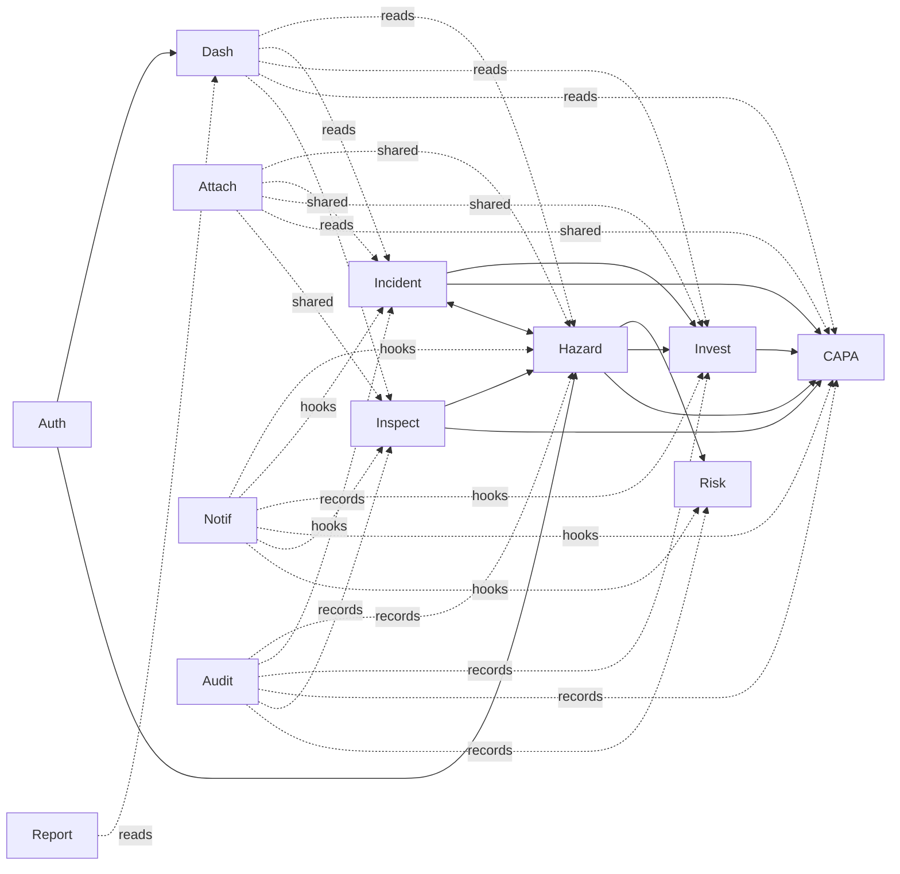

Build order implied by dependencies (matches the follow-up sequence): Foundation → Auth → **Attachments (shared)** → Hazard → Hazard Workflow → **Incident** → Risk → Investigation → CAPA → Inspections → Dashboard → Reporting → Notifications → Audit Viewer.

---

## 5. System Architecture

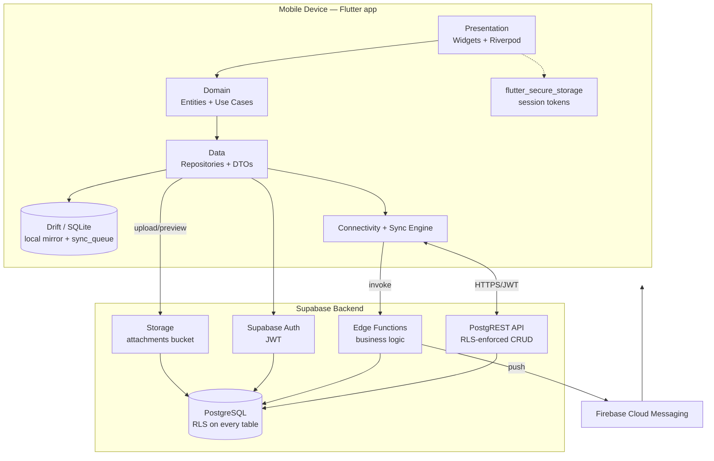

- **Client** is a thin, offline-capable Clean-Architecture app; the **server** is the source of truth and security boundary.
- **Realtime** (Supabase Realtime) is *out of scope for MVP1* but the read-model layer is designed so it can subscribe later without redesign. 🔖 (Deviation note.)

---

## 6. Layered Architecture (Clean Architecture)

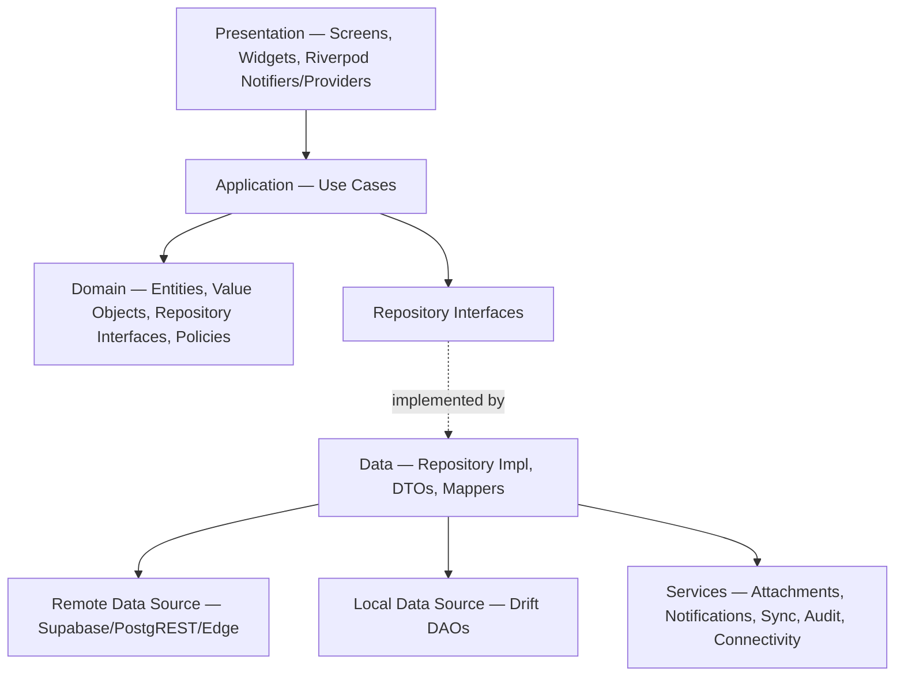

**Dependency rule:** arrows point inward; Domain has zero framework imports.

| Layer | Contents | Folder (confirmed in Prompt 4A) |
|---|---|---|
| Presentation | Screens, widgets, Riverpod providers/notifiers, routing | `lib/features/<feature>/presentation` |
| Application | Use cases (one intent each) | `lib/features/<feature>/application` |
| Domain | Entities, value objects, repo interfaces, workflow policies | `lib/features/<feature>/domain` |
| Data | Repo implementations, DTOs, mappers, local/remote data sources | `lib/features/<feature>/data` |
| Shared/Core | Theme, design tokens, errors, result types, base widgets | `lib/core`, `lib/shared` |
| Services | Cross-cutting (attachments, notifications, sync, audit, supabase, drift) | `lib/services` |

> 🔖 Folder pattern proposed: `lib/features/<feature>/{presentation, application, domain, data}` + root `lib/{core, shared, features, services, repositories}` + `app.dart`. Confirmed in Prompt 4A.

---

## 7. Entity Relationships & ERD

### 7.1 Relationship rules

- Tenant root: `companies (1) → sites (N) → departments (N) → user_profiles (N)`.
- `hazards (1) → risk_assessments (N)` (history of assessments; latest is authoritative).
- **Polymorphic-but-typed source linkage** with FK integrity (🔖 Decision D2): instead of a single untyped `(source_type, source_id)`, linkable children carry **typed nullable FKs + a CHECK constraint** ensuring exactly one origin is set. This preserves referential integrity in Postgres.
  - `investigations`: `hazard_id?`, `incident_id?` — CHECK exactly one set.
  - `corrective_actions`: `hazard_id?`, `incident_id?`, `investigation_id?`, `inspection_item_id?` — CHECK exactly one set.
- **Hazard ↔ Incident bidirectional linkage:** `hazards.source_incident_id?` and `incidents.source_hazard_id?` (both nullable FKs). Supports "hazard led to incident" and "incident generated follow-up hazard".
- **Attachments are polymorphic** across Hazard/Incident/Investigation/CAPA/Inspection via `(owner_type, owner_id)`; `attachment_versions (N) → attachments (1)`.
- Every tenant-scoped table carries `company_id` (and `site_id` where relevant) — see §14.

### 7.2 ERD

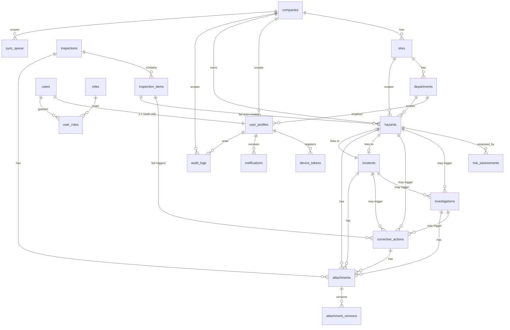

Full column-level schema, PKs, FKs, indexes, constraints, and migrations are **Prompt 2A**; RLS is **Prompt 2B**.

---

## 8. API Strategy (PostgREST + Edge Functions)

### 8.1 PostgREST (auto-generated CRUD, RLS-enforced)

Standard `GET / POST / PATCH / DELETE` per table, filtered by RLS. Client uses `supabase-flutter` query builder — no bespoke REST layer.

| Table group | Client operations | Notes |
|---|---|---|
| hazards, incidents, risk_assessments, investigations, corrective_actions, inspections, inspection_items | list / read / create / update (status via guarded path) | writes go through offline outbox first (§10) |
| notifications | list / mark-read | insert is server-side only |
| attachments, attachment_versions | list / read | object bytes via Storage API |
| audit_logs | **read-only** | no client insert/update/delete (§12) |
| companies, sites, departments, roles | read (admin writes) | reference data |

### 8.2 Edge Functions (business logic that CRUD+RLS cannot express)

| Function | Trigger | Responsibility |
|---|---|---|
| `inspection-item-fail` | inspection item marked *fail* | Atomically create a Hazard **and** a CAPA linked to the item; write audit rows. |
| `workflow-transition` | status-change request on Hazard/Incident/CAPA | Enforce guarded transitions (e.g. block *Closed* without verification evidence + closed CAPAs); write before/after audit. |
| `dashboard-aggregates` | scheduled + on-demand | Compute/cache role-scoped KPI aggregates for <3s dashboard load. |
| `notify-fanout` | CAPA assigned/overdue, new hazard/incident, investigation/inspection due | Insert `notifications` rows + push via FCM to `device_tokens`. |
| `access-token-hook` (optional) | auth token mint | Stamp role/company/site claims (see §9 alternative). 🔖 |

Contracts (request/response JSON shapes) are specified per module in their respective prompts; this section fixes **which** logic is server-side and **why**.

---

## 9. Security Architecture

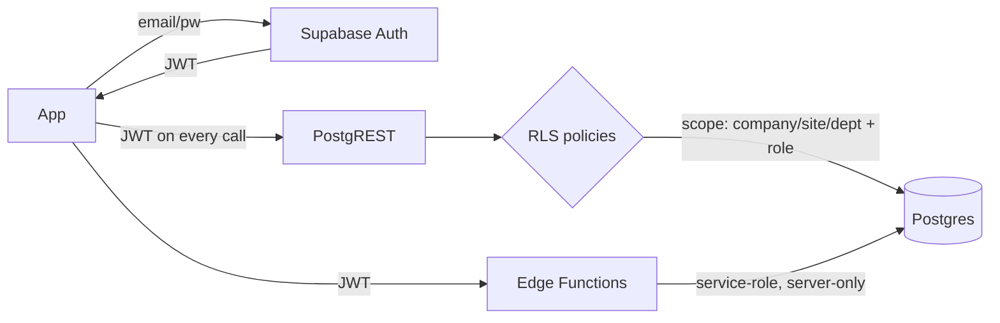

- **AuthN:** Supabase Auth (email/password). Tokens in `flutter_secure_storage` (Keychain/Keystore). 🔖 (confirmed Prompt 5).
- **AuthZ:** RLS on **every** table (Prompt 2B). The client cannot widen its own scope.
- **🔖 Decision D3 — RLS scoping claim source:** authoritative scope (`company_id`, `site_id`, `department_id`, `role`) is resolved from `user_profiles`/`user_roles` via **`SECURITY DEFINER` helper functions** (e.g. `auth.current_company_id()`), keyed on `auth.uid()`. Rationale: always current (role/site changes take effect immediately, no token refresh), and avoids stale JWT claims. Optional promotion to JWT claims via `access-token-hook` is reserved as a performance optimisation and recorded as a deviation, not adopted in MVP1.
- **Service-role boundary:** the service-role key lives **only** inside Edge Functions/server env, never in the app. No hardcoded secrets — all via env vars / `--dart-define`.
- **POPIA:** witness/injured-party PII minimised and gated behind role-restricted RLS; audit + storage support subject access/erasure without breaking audit immutability (erasure handled by redaction of PII columns, not deletion of audit rows).
- **Storage security:** per-object policies keyed to the owning record's tenant scope + role (Prompt 2B / §13).

---

## 10. RBAC Model

Enforced at **two layers**: (1) RLS at the DB (authoritative), (2) conditional UI rendering (UX only). The matrix below is the Master Prompt's — restated for traceability; each action maps to a policy family verified in Prompt 2B.

| Action | Emp | Sup | SO | Mgr | Admin | Enforced by |
|---|:--:|:--:|:--:|:--:|:--:|---|
| Report Hazard / Incident | ✅ | ✅ | ✅ | ✅ | ✅ | INSERT policy (any authenticated in-scope) |
| Perform Risk Assessment | ❌ | ✅ | ✅ | ✅ | ✅ | INSERT/UPDATE on `risk_assessments` |
| Conduct Investigation | ❌ | ✅ | ✅ | ✅ | ✅ | INSERT/UPDATE on `investigations` |
| Create / Assign CAPA | ❌ | ✅ | ✅ | ✅ | ✅ | INSERT/UPDATE on `corrective_actions` |
| Verify & Close CAPA | ❌ | ❌ | ✅ | ✅ | ✅ | UPDATE (status→Verification/Closed) role check |
| Close Hazard / Incident | ❌ | ❌ | ✅ | ✅ | ✅ | `workflow-transition` + UPDATE role check |
| Conduct Inspections | ❌ | ✅ | ✅ | ✅ | ✅ | INSERT/UPDATE on `inspections` |
| View Own Records | ✅ | ✅ | ✅ | ✅ | ✅ | SELECT (row.reporter = uid) |
| View Department Records | ❌ | ✅ | ✅ | ✅ | ✅ | SELECT (dept scope) |
| View Site / Enterprise Dashboards | ❌ | ❌ | ✅ | ✅ | ✅ | SELECT (site/enterprise scope) |
| Manage Users & Roles | ❌ | ❌ | ❌ | ❌ | ✅ | INSERT/UPDATE/DELETE on `user_roles` |
| View Audit Log | ❌ | ❌ | ✅ | ✅ | ✅ | SELECT on `audit_logs` (role ∈ {SO,Mgr,Admin}) |

**Self-check (role coverage):** every one of the 12 actions above has an explicit allow-set; all five roles appear; no action is left unmapped. Deny is the default (RLS denies unless a policy grants). Full role×action→policy proof is produced in Prompt 2B.

---

## 11. Offline Synchronization Architecture

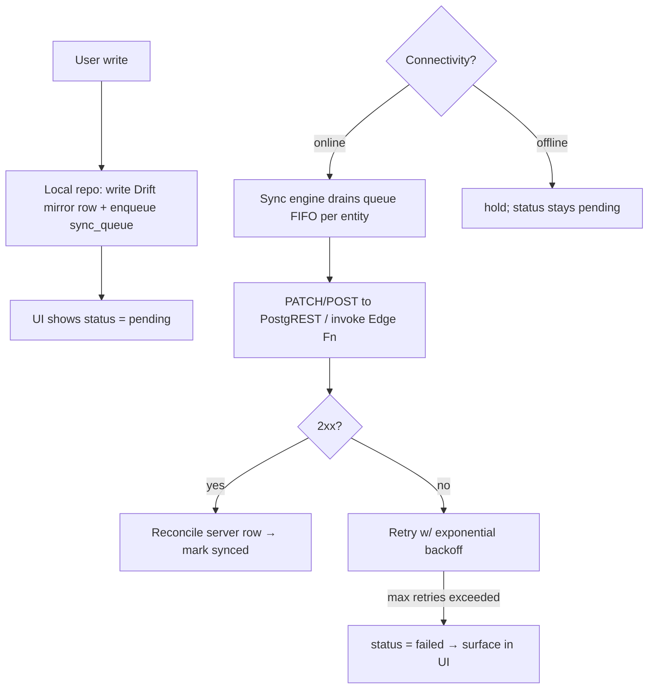

- **Local store:** Drift (SQLite) mirrors server tables for Hazard, Incident, Inspection, CAPA (offline-writable), plus a local `sync_queue` mirroring the server schema.
- **Outbox pattern:** every offline-capable mutation writes the domain row locally **and** appends a `sync_queue` entry (op, entity, payload, base_version, attempts, status).
- **🔖 Decision D4 — Conflict resolution (two-tier):**
  - **Last-Write-Wins + audit trail** (server timestamp authoritative) for single-owner / workflow records: `hazards`, `incidents`, `risk_assessments`, `investigations`. Overwrites are recorded in `audit_logs` so nothing is silently lost.
  - **Field-level merge** for records with concurrent disjoint edits: `corrective_actions` (owner updates progress while SO edits verification) and `inspection_items` (independent checklist lines). Non-conflicting fields merge; genuine same-field conflicts fall back to LWW + audit.
  - Per-entity assignment is re-stated and finalised in Prompt 4B.
- **🔖 Decision D5 — Retry policy:** exponential backoff, base 2 s, factor 2, max 5 attempts, cap 60 s, ±20% jitter. After max attempts → `failed`, user-retryable.
- **Sync status model (per record, in UI):** `pending · syncing · synced · failed` (locked set).

Detailed engine, DAOs, and worked create/update/conflict scenarios are **Prompt 4B**.

---

## 12. Notification Architecture

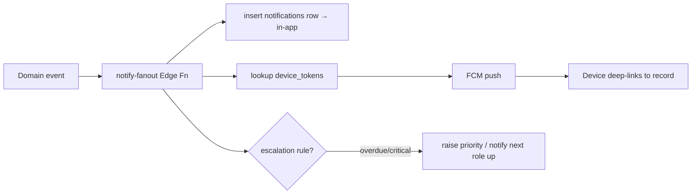

- **Channels:** Push (FCM), In-App (`notifications` table), Email (reserved — interface stubbed, not shipped).
- **Triggers (🔖 canonical hook names):** `hazard.created` · `incident.created` · `risk.assessed` · `capa.assigned` · `capa.overdue` · `investigation.due` · `inspection.due`. Stubbed in Prompts 8–12/8A, consolidated in Prompt 15.
- **Attributes:** priority, escalation, read status. Each device registers a token in `device_tokens`.
- **Offline:** notifications generated while a device is offline are stored server-side and delivered/rendered on reconnect; local read-state changes queue like any other mutation.

---

## 13. Attachment Architecture (with version history)

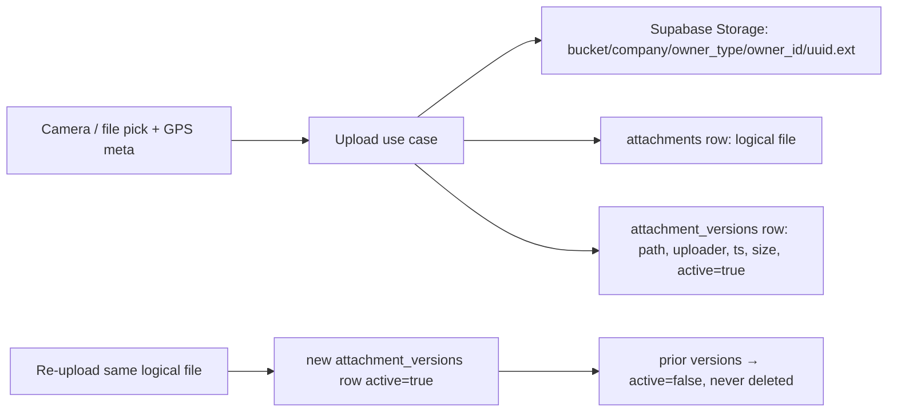

- **Why app-layer versioning:** Supabase Storage overwrites objects at a path and has no native version history. Each upload creates a new `attachment_versions` row; superseded versions are marked **inactive**, never deleted (Master Prompt requirement).
- **Constraints:** max 20 MB; JPG/PNG/PDF only (validated client-side and re-checked server-side).
- **Operations:** Preview · Download · Delete (logical/soft) · List Version History.
- **Linked owners:** Hazard · Incident · Investigation · CAPA · Inspection via `(owner_type, owner_id)`.
- **Offline:** uploads made offline queue as binary + metadata and flush via the sync engine on reconnect.
- **Security:** Storage access policies mirror the owning record's RLS scope + role (Prompt 2B).
- The concrete service API surface (`upload/preview/download/delete/listVersions`) is fixed in **Prompt 6** and recorded in the Ledger then.

---

## 14. Audit Logging Architecture

- **What:** every business action (Hazard Created, Risk Updated, CAPA Assigned/Closed, Incident Modified, Inspection Submitted, status transitions, linkage changes).
- **Shape:** `user · action · timestamp · entity_type · entity_id · before_state(JSONB) · after_state(JSONB) · company_id`.
- **Where written:** at the DB via triggers for direct CRUD, and inside `workflow-transition`/`inspection-item-fail` Edge Functions for guarded logic — so audit cannot be bypassed by the client.
- **🔖 Decision D6 — Immutability:** `audit_logs` grants **INSERT + SELECT only**; **no UPDATE/DELETE** to any role (enforced Prompt 2B). POPIA erasure is handled by redacting PII in the *referenced* business rows, never by mutating audit history.
- **Read path:** Audit Log Viewer (Prompt 16), restricted to Safety Officer / Manager / Administrator, filterable by user/action/date/entity with before↔after diff.
- **🔖 Audit helper contract (conceptual):** `recordAudit(entityType, entityId, action, before, after)` — actor and company derived from session/RLS context, not passed by the client. Final signature set in Prompt 4A/5.

---

## 15. Multi-Site Architecture

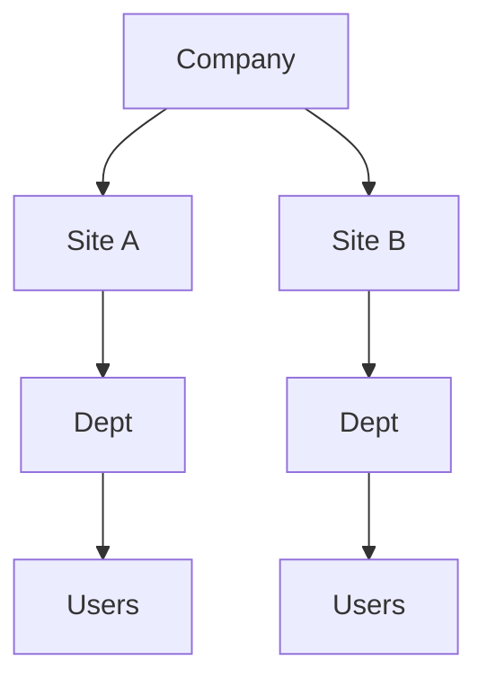

- **Isolation columns:** `company_id` on **every** tenant-scoped table; `site_id` where a row belongs to a site; `department_id` where relevant. (Reference/global tables like `roles` are exempt — 🔖 noted.)
- **RLS scoping (hierarchical):** a user sees rows within their company always; site/department narrowing and enterprise widening are governed by role per §10 (Employee = own; Supervisor = department; Safety Officer = site; Manager/Admin = enterprise).
- **Indexing:** all `company_id` / `site_id` / `status` columns indexed (they drive both RLS and dashboard filters) — specified in Prompt 2A.
- **Aggregation:** dashboards/reports support Site filter, Department filter, and Enterprise rollup from MVP1, scoped by role (Prompt 13).

---

## 16. Navigation Architecture

- **Router:** GoRouter, declarative, with an **auth redirect guard** (unauthenticated → Login) and a **role guard** on restricted routes (Audit Viewer, User Management).
- **Shell:** a `StatefulShellRoute` hosting the floating pill bottom nav (Master Prompt Item 8): **Dashboard · Hazards · Actions · More**. Future MVP modules mount under **More** without changing the shell.
- **Deep links:** notification taps route to the target record (`/hazards/:id`, `/capa/:id`, etc.).

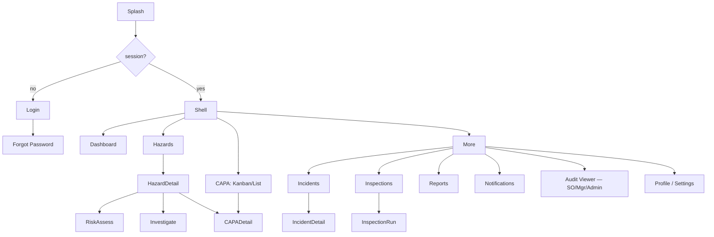

Full screen inventory, states (empty/loading/error/offline), and component specs are **Prompt 3**.

---

## 17. Architectural Decisions captured for the Ledger (pending approval)

> Not yet written to `DECISIONS_LEDGER.md` — committed on your approval per the update-on-approval rule.

| ID | Decision | Ledger slot |
|---|---|---|
| D1 | Add `companies` table as tenant root | §1 Table additions + §7 Open Questions |
| D2 | Typed nullable FKs + CHECK for source linkage (not untyped polymorphic) | §7 Open Questions / cross-cutting |
| D3 | RLS scope via `SECURITY DEFINER` helpers reading `user_profiles`/`user_roles` (JWT-claims optional, deferred) | §5 RLS scoping claim source |
| D4 | Conflict resolution two-tier: LWW+audit (hazard/incident/risk/investigation), field-merge (CAPA/inspection_item) | §4 Conflict resolution rule |
| D5 | Retry/backoff: base 2 s, ×2, max 5, cap 60 s, ±20% jitter | §4 Retry/backoff policy |
| D6 | `audit_logs` immutable — INSERT+SELECT only, no UPDATE/DELETE | §5 Audit-viewer / immutability |
| D7 | Notification hook names: `hazard.created`, `incident.created`, `risk.assessed`, `capa.assigned`, `capa.overdue`, `investigation.due`, `inspection.due` | §3 Notification trigger hook names |
| D8 | Feature folder pattern `features/<f>/{presentation,application,domain,data}` (confirm Prompt 4A) | §1 Feature folder structure |

### Open Questions / Deviations
- **OQ1:** Confirm `companies` addition to the table list (D1) at Prompt 2A.
- **OQ2:** Confirm typed-FK-linkage vs. untyped polymorphic (D2) at Prompt 2A.
- **DEV1:** Supabase Realtime not used in MVP1 (read-models designed to allow it later).
- **DEV2:** JWT-claims access-token hook deferred in favour of helper functions (D3) — revisit if RLS function-call overhead becomes a performance concern against the <3 s dashboard target.

---

## 18. Self-Verification

| Constraint | Check |
|---|---|
| All 19 mandated tables placed in a context | ✅ §3 (+ `companies` proposed, D1) |
| Locked status flows unchanged | ✅ §1.1 restated verbatim from Master Prompt |
| RBAC matrix fully mapped, deny-by-default | ✅ §10 (12/12 actions, 5/5 roles) |
| Every tenant table carries `company_id` (+`site_id`) | ✅ §15 (reference tables exempted, noted) |
| Audit has no mutation path | ✅ §14 D6 |
| No application code emitted | ✅ diagrams + contracts only |
| Icon referenced by path, never redrawn | ✅ P5 |

**End of Prompt 1 deliverable.**
