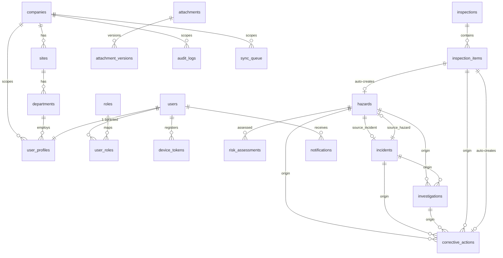

# OHS Shield Tracker — MVP 1 Database Schema (Prompt 2A)

> **Structure only.** RLS, policies, and immutability grants are **Prompt 2B**. Source of truth: `MVP1_1.md` + `DECISIONS_LEDGER.md`. No sample data (DATA QUALITY RULE).
>
> **Status:** Draft for human approval. New decisions marked 🔖.

## SQL artifacts (apply in order)

| File | Contents |
|---|---|
| [0001_types_and_helpers.sql](../supabase/migrations/0001_types_and_helpers.sql) | extensions, `set_updated_at()`, `bump_version()`, all ENUM types |
| [0002_identity_and_org.sql](../supabase/migrations/0002_identity_and_org.sql) | companies, sites, departments, users, roles, user_roles, user_profiles |
| [0003_safety_core.sql](../supabase/migrations/0003_safety_core.sql) | hazards, risk_assessments, incidents, investigations, corrective_actions, inspections, inspection_items |
| [0004_cross_cutting.sql](../supabase/migrations/0004_cross_cutting.sql) | notifications, device_tokens, attachments, attachment_versions, audit_logs, sync_queue |
| [0005_indexes_and_triggers.sql](../supabase/migrations/0005_indexes_and_triggers.sql) | all indexes, updated_at/version triggers, auth.users→users mirror |
| [seed.sql](../supabase/seed.sql) | the 5 RBAC roles only |

---

## 1. Database Naming Standards

| Object | Convention | Example |
|---|---|---|
| Table | `snake_case`, plural | `corrective_actions` |
| Column | `snake_case`, singular | `due_date` |
| Primary key | `id` (uuid, `gen_random_uuid()`) | `hazards.id` |
| Foreign key column | `<referenced_singular>_id` | `hazard_id`, `reporter_id` |
| Timestamps | `created_at`, `updated_at` (timestamptz) | — |
| Boolean | `is_` / `has_` prefix | `is_active` |
| Enum type | `<subject>[_<attr>]` | `hazard_status`, `capa_priority` |
| Unique constraint | `uq_<table>_<cols>` | `uq_incidents_company_reference` |
| Check constraint | `ck_<table>_<rule>` | `ck_capa_one_source` |
| FK constraint (explicit) | `fk_<table>_<ref>` | `fk_hazards_source_incident` |
| Index | `idx_<table>_<cols>` | `idx_hazards_status` |
| Trigger | `trg_<table>_<purpose>` | `trg_capa_version` |

- **🔖 D-schema-1:** identifiers are `snake_case`; tables plural, columns singular.
- All PKs are UUID (offline-friendly: clients can mint IDs before sync, avoiding server round-trips).
- `on delete restrict` for tenant-structural FKs (company/site); `on delete set null` for optional links; `on delete cascade` for owned children (risk_assessments, inspection_items, attachment_versions).

## 2. Key structural decisions

- **`companies` table added** (D1/OQ1) as tenant root. `Company → Site → Department → User`.
- **`users` vs `user_profiles`:** `users` mirrors `auth.users` (id, email, active) via `handle_new_auth_user()`; `user_profiles` holds org scope (`company_id`/`site_id`/`department_id`) + minimal personal fields.
- **Typed-FK linkage (D2/OQ2):** `investigations` and `corrective_actions` use nullable typed FKs + a `CHECK` enforcing **exactly one** origin. Hazard↔Incident is bidirectional via `hazards.source_incident_id` + `incidents.source_hazard_id` (cycle closed with a deferred `ALTER`).
- **Generated risk band:** `risk_assessments.risk_score` and `risk_band` are `GENERATED ALWAYS ... STORED` from `likelihood × severity` — the risk bands can never drift from the Master Prompt (see §5 self-check).
- **`version` column** on all offline-writable/conflict-managed tables (hazards, incidents, risk_assessments, investigations, corrective_actions, inspections, inspection_items), auto-bumped by `bump_version()` — supports D4 conflict resolution (`sync_queue.base_version`).
- **🔖 D9 — witnesses/injured party as POPIA-minimal JSONB** on `incidents` (not a separate table), keeping the mandated table set intact; visibility is governed by the incident row's RLS (Prompt 2B). Revisit if per-field erasure/audit granularity is required.
- **Attachments** are polymorphic via `(owner_type, owner_id)`; version history in `attachment_versions` (superseded → `is_active=false`, never deleted), with `file_size <= 20 MB` and content-type CHECK (JPG/PNG/PDF).
- **`audit_logs`** has no `updated_at` (write-once); mutation is blocked by grants in Prompt 2B.

## 3. ERD

## 4. Migration Strategy

- **Tooling:** Supabase CLI migrations (`supabase/migrations/NNNN_*.sql`), forward-only, one logical concern per file, applied in filename order.
- **Ordering constraint:** 0001 (types) → 0002 (org/identity) → 0003 (safety core; closes the hazards↔incidents cycle via `ALTER`) → 0004 (cross-cutting) → 0005 (indexes/triggers). 2B appends `0006_rls_*`.
- **Environments:** separate Supabase projects for Dev/Test/UAT/Prod (detailed in Prompt 18); the same migration set promotes across all.
- **Rollback:** each migration is paired with a documented reverse (drop in reverse dependency order); destructive changes are gated behind review. Enums are extended with `ALTER TYPE ... ADD VALUE` (never reordered) to stay backward-compatible.
- **Seed:** `seed.sql` is idempotent (`on conflict do nothing`) and contains reference data only.

---

## 5. Self-Verification

### 5.1 Tenant scope + indexing (required self-check)

Every tenant-scoped table carries `company_id` (and `site_id`/`department_id` where a row belongs to one), and each is indexed.

| Table | company_id | site_id | department_id | indexed |
|---|:--:|:--:|:--:|:--:|
| sites | ✅ | — (is a site) | — | ✅ |
| departments | ✅ | ✅ | — | ✅ |
| user_profiles | ✅ | ✅ | ✅ | ✅ |
| user_roles | ✅ | ✅ | — | ✅ |
| hazards | ✅ | ✅ | ✅ | ✅ |
| risk_assessments | ✅ | via hazard | — | ✅ |
| incidents | ✅ | ✅ | ✅ | ✅ |
| investigations | ✅ | ✅ | — | ✅ |
| corrective_actions | ✅ | ✅ | — | ✅ |
| inspections | ✅ | ✅ | ✅ | ✅ |
| inspection_items | ✅ | via inspection | — | ✅ |
| notifications | ✅ | — | — | ✅ |
| device_tokens | ✅ | — | — | ✅ |
| attachments | ✅ | via owner | — | ✅ |
| attachment_versions | ✅ | via attachment | — | ✅ |
| audit_logs | ✅ | — | — | ✅ |
| sync_queue | ✅ | — | — | ✅ |

**Exempt (global reference, not tenant-scoped):** `roles`, `users` (`users` is identity, scoped via `user_profiles`). ✅ matches Ledger §5 exception.

### 5.2 Status columns indexed (dashboard filters)

`hazards.status`, `incidents.status`, `investigations.status`, `corrective_actions.status`, `inspections.status`, `inspection_items.result`, `sync_queue.status`, `notifications.is_read` — all indexed. ✅

### 5.3 Risk band coverage (generated column, no gaps 1–25)

| Score range | CASE branch | Band |
|---|---|---|
| 1–5 | `between 1 and 5` | low |
| 6–12 | `between 6 and 12` | medium |
| 13–17 | `between 13 and 17` | high |
| 18–25 | `else` | critical |

`likelihood`/`severity` each CHECK `between 1 and 5`, so the product is always 1–25 → exactly one band, no gaps/overlaps. ✅ (Reachable-value proof deferred to Prompt 9's calculator.)

### 5.4 Linkage integrity

`ck_investigations_one_source` (1 of 2) and `ck_capa_one_source` (1 of 4) guarantee exactly one origin per row. ✅

### 5.5 Full mandated table list present

companies(+), sites, departments, users, roles, user_roles, user_profiles, hazards, risk_assessments, incidents, investigations, corrective_actions, inspections, inspection_items, notifications, device_tokens, attachments, attachment_versions, audit_logs, sync_queue = **20 tables**. ✅

---

## 6. Decisions captured for the Ledger (pending approval)

| ID | Decision | Slot |
|---|---|---|
| D-schema-1 | Naming: snake_case, plural tables / singular columns, uuid PKs | §1 Table naming convention |
| D1 (confirmed) | `companies` table added as tenant root | §1 additions → confirmed |
| D2 (confirmed) | Typed-FK + CHECK linkage implemented | §1 source-linkage |
| D9 | Witnesses/injured party as POPIA-minimal JSONB on `incidents` | §7 Deviations |

**End of Prompt 2A deliverable.**
