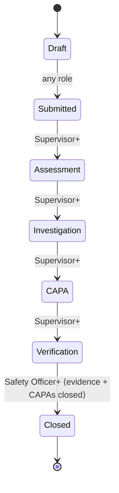

# OHS Shield Tracker — Hazard Lifecycle Engine (Prompt 8)

> Adds the enforceable workflow on top of the Hazard module (Prompt 7). Source of truth: `MVP1_2.md` + `DECISIONS_LEDGER.md`. Notification delivery is stubbed (Prompt 15).
>
> **Status:** Draft for human approval. Review-ready (needs `build_runner`, `supabase functions deploy workflow-transition`).

## Files
- domain: `hazard_workflow.dart` (state machine + guards), `hazard_escalation.dart`
- services: `lib/services/notifications/notification_triggers.dart` (stub + canonical trigger names, D7)
- presentation: `hazard_providers.dart` (+ `hazardGuardContextProvider`, `HazardWorkflowController`), `hazard_detail_screen.dart` (workflow action)
- server: `supabase/functions/workflow-transition/index.ts`
- tests: `hazard_workflow_test.dart`, `hazard_escalation_test.dart`

## 1. State machine

Forward-only, one adjacent step per action (matches the locked STATUS GOVERNANCE flow). `HazardWorkflow.next/minRankFor/advanceLabel/canTransition` are pure and code-enforced.

## 2. Transition rules (enforceable in code)
| From → To | Role | Guard |
|---|---|---|
| Draft → Submitted | any (rank ≥1) | — |
| Submitted → Assessment | Supervisor+ | — |
| Assessment → Investigation | Supervisor+ | — |
| Investigation → CAPA | Supervisor+ | — |
| CAPA → Verification | Supervisor+ | — |
| Verification → **Closed** | **Safety Officer+** | **verification evidence exists AND all linked CAPAs closed** |

- **Client**: `HazardWorkflowController.advance` validates with `HazardWorkflow.canTransition` (role + guard) before acting. Non-close steps go through the **offline outbox** (LWW). **Close** is routed to the `workflow-transition` **Edge Function** (online-only) which re-checks everything under the service role.
- **Server (authoritative)**: RLS already gates who may write which status (2B — close ⇒ rank ≥3). The Edge Function additionally enforces the two data guards and sets `closed_at`.

## 3. Escalation rules
`HazardEscalation.evaluate` (pure): closed → none; **critical risk → critical** always; otherwise stage SLA (Submitted 2d · Assessment 3d · Investigation 5d · CAPA 7d · Verification 3d) → `dueSoon`/`overdue`. `shouldNotify` = overdue|critical. (MVP proxies stage age from `reportedAt`; per-stage entry timestamps are a noted future refinement.)

## 4. Notification triggers (stubs → Prompt 15)
`NotificationTriggers.fire(<trigger>, entityType, entityId)` records intent only. Wired now: `hazard.created` on report; `investigation.due` when entering Investigation. Full in-app + FCM fan-out replaces the stub in Prompt 15 (`notify-fanout`).

## 5. Audit events
Transitions are `UPDATE`s on `hazards`, so the `audit_row_change` trigger (0012) writes an immutable `hazard.status_changed` audit row (before/after) automatically — including the server-side close.

## 6. Self-Check
| Rule | Enforced / test |
|---|---|
| Close blocked without evidence | policy + Edge Function (409); `hazard_workflow_test` |
| Close blocked with open CAPA | policy + Edge Function (409); test |
| Close is Safety Officer+ | policy + RLS + Edge Function; test |
| Forward-only, adjacent | `HazardWorkflow._forward`; test (non-adjacent denied) |
| Critical risk escalates | `hazard_escalation_test` |
| Every transition audited | trigger 0012 (`status_changed`) |

## 7. Ledger note (pending approval)
- Notification stub + canonical trigger names live at `lib/services/notifications/notification_triggers.dart` (consumed by Prompts 8–12; replaced in 15).
- `workflow-transition` Edge Function now implemented for Hazard close (extensible to Incident close in 8A).

**End of Prompt 8 deliverable.**
