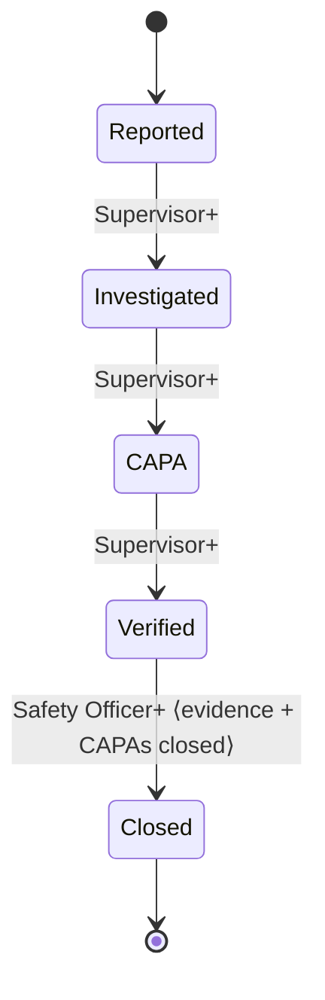

# OHS Shield Tracker — Incident Management (Prompt 8A)

> First-class entity, separate from Hazard (Domain Model Rule). Consumes attachments (6), sync (4B), audit, and the workflow Edge Function (8). Source of truth: `MVP1_2.md` + `DECISIONS_LEDGER.md`. Satisfies Success Criteria #7 & #8.
>
> **Status:** Draft for human approval. Review-ready (needs `pub get`, `build_runner`, migrations `0013`, redeploy `workflow-transition`).

## Files
- server: `supabase/migrations/0013_incident_capa_audit.sql` (audit triggers: incidents, investigations, corrective_actions); `supabase/functions/workflow-transition/index.ts` (generalised hazard|incident)
- domain: `entities/{incident_enums, witness, incident, incident_filter}.dart`, `incident_workflow.dart`, `repositories/incident_repository.dart`
- data: `incident_dto.dart`, `incident_repository_impl.dart`
- application: `incident_use_cases.dart`
- presentation: `providers/incident_providers.dart`, `widgets/incident_ui.dart`, `screens/{incident_list, incident_report, incident_detail}_screen.dart`
- tests: `incident_workflow_test.dart`, `incident_dto_test.dart`

## 1. Domain
- **Type** (6, locked), **Severity** (Minor/Moderate/Serious/Critical → Green/Amber/Red/Red-full — `incident_ui.dart`), **Status** (Reported→Investigated→CAPA→Verified→Closed). No per-module scale invented.
- **Witnesses**: POPIA-minimal `Witness` (name + optional contact/statement) stored as JSONB on `incidents` (D9); visibility via the incident's RLS.

## 2. Capture / offline / audit
- Report screen: type, severity, occurred date+time, description, location + GPS, witnesses, photos/evidence (shared `AttachmentField`).
- Create/update via the offline outbox (entity `incident`) — visible immediately with a sync badge, LWW on reconnect. List/detail merge server + cache.
- Every create/modify/status-change audited via the `0013` trigger (`incident.*`).

## 3. Workflow (enforceable)
`IncidentWorkflow` (pure): forward-only adjacent. **Close = Safety Officer+ AND verification evidence AND all linked CAPAs closed.** Non-close steps → offline outbox; **Close → `workflow-transition` Edge Function** (now handles `entityType: hazard|incident`), online-only, re-checking role + both guards under the service role.

## 4. Linkage engine
- **Hazard ↔ Incident** (bidirectional): `linkToHazard` sets `incidents.source_hazard_id` + `hazards.source_incident_id`.
- **Incident → Investigation / CAPA**: `generateInvestigation` / `generateCapa` insert typed-FK rows (`incident_id` set; CHECK guarantees exactly-one-origin). These are managed fully by Prompts 10/11; created here so the incident can spawn them. Linkage/generation require connectivity (Supervisor+).

## 5. RBAC & multi-site
All roles may **report**; only **SO/Manager/Admin** may **close** (policy + RLS + Edge Function). Company/site/department scoping via RLS; list supports severity/status/type/site + "Mine".

## 6. Self-Check
| Rule | Enforced / test |
|---|---|
| Incident ≠ Hazard (separate tables/entities/workflow) | distinct module + `incidents` table; bidirectional link only |
| Locked severity scale | `IncidentSeverity` enum + colour map; `incident_dto_test` |
| POPIA witnesses minimal + RLS-scoped | `Witness` (name + optional); JSONB on incident |
| Linkage integrity (0/1 hazard; 0..n inv/CAPA) | typed FKs + DB CHECK exactly-one-origin |
| Close blocked w/o evidence or open CAPA | policy + Edge Function (409); `incident_workflow_test` |
| Close = SO+ | policy + RLS + Edge Function; test |
| Every change audited | trigger 0013 |

**DoD:** report any of 6 types, attach photo/GPS, capture witnesses (POPIA), link to a hazard and/or generate investigation + CAPA, transition through every status, and close — audit-logged, offline-capable. ✔ (Success Criteria #7, #8.)

## 7. Ledger note (pending approval)
- Incident module at `lib/features/incidents`; `workflow-transition` now hazard|incident; audit triggers on incidents/investigations/corrective_actions (0013).

**End of Prompt 8A deliverable.**
